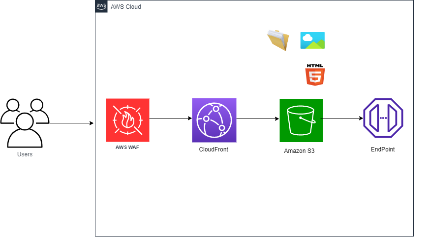

# TCC-AWS-GRUPO3-ESCOLA-DA-NUVEM
Aplicação Feita Pro TCC do Curso Da Escola da Nuvem, Fundamentos Da AWS

Objetivo desse Repositório é documentar nosso Aprendizado em Aws,Desenvolvendo  um website (html, css, imagens) contendo os currículos do grupo.
E a implantação de um ou mais serviços na nuvem AWS.
Com rede de entrega de conteúdo, com baixa latência, com segurança, e armazenamento durável, para 
atender a demanda de 11 milhões de requisições¹ por mês.

